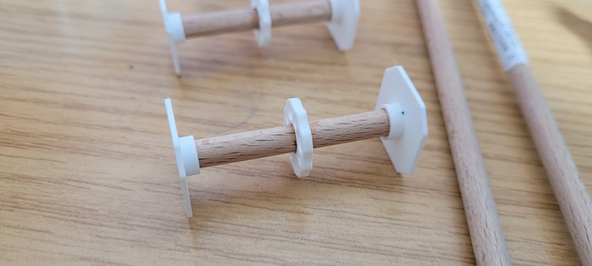

# Zuammbauanleitung Standfuß und Anfangsstück
Die Teile sind so klein, dass sie in ein Objekt vereint wurden.
Für das Anfangstück wird der letzte Schritt übersprungen.

## Variationen
Für die Stückliste der einzelnen Variationen siehe [hier](Materialplanung.md#sonstige).
Zur Vereinfachung werden hier nur Rundstab, Flansch, Adapter und Fuß verwendet.

## 🛠 Zusammenbau

* Länge den Rundstab auf 44mm Länge ab.
* Markiere die Seite die unten sein soll.
* Markiere nun von unten 22mm weiter oben wo der Flansch sein soll.
* Schiebe einen Flansch auf den Rundstab und blebe ihn oberhalb der Markierung fest.
* Klebe den Rundstab (unmarkierte Seite) in das kleine Loch des Adapters.
* Für das Anfangsstück überspringe diesen Schritt.
Klebe die Unterseite des Rundstabes in die runde Vertiefung des Fußes.
Achte dabei darauf, dass die kleinen Löcher des Flansches zu den seiten des Fußes zeigen.

## Weiter Tipps zum Zusammenbau
* Nach dem Ankleben des Knotenstücks an das Anfangsstück das Anfangsstück jeweils oben und unten in eine Fußplatte stecken und waagerecht trocknen lassen

## 📄 Relevante Dateien
* [Flansch](../Drucker%20Dateien/Flansch.STL)
* [Fuß](../Drucker%20Dateien/Fuß.STL)
* [Fußadapter Simpel](../Drucker%20Dateien/Fußadapter%20Simpel.STL)
---
[Zurück zur Hauptanleitung](README.md)