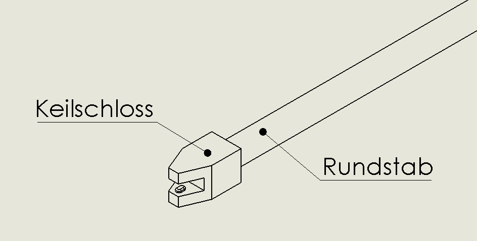
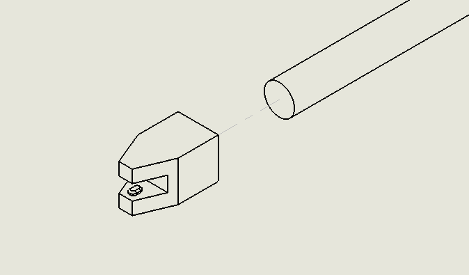

# Zuammbauanleitung Riegel 

## Variationen
Für die Stückliste der einzelnen Variationen siehe [hier](Materialplanung.md#riegel).
Zur Vereinfachung werden hier nur Rundstab und Keilschloss verwendet

## 🛠 Zusammenbau

* Länge den Rundstab auf die benötiget Länge ab
	* 2x1 -> 110mm
	* 2x2 -> 240mm
	* 2x3 -> 370mm
* Klebe auf jede Seite ein Keilschloss so, dass das Ende des Rundstabes in das runde Loch des Keilschloss steckt.
Achte dabei darauf, dass die Keilschlösser auf beiden Seiten gleich ausgerichtet sind. Der Kleber ist nicht sofort fest,du kannst den Tisch als hilfe nehmen.

## 📄 Relevante Dateien
* [Horizontale Keilschloss](../Drucker%20Dateien/Horizontale%20Keilschloss.STL)
---
[Zurück zur Hauptanleitung](../README.md)