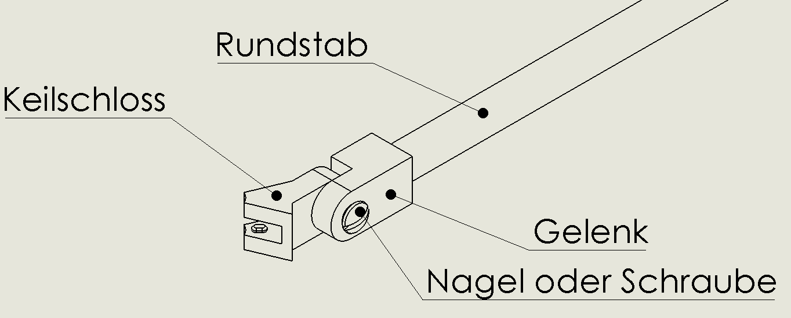
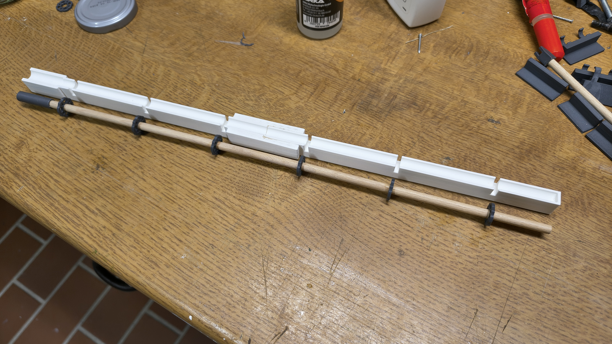
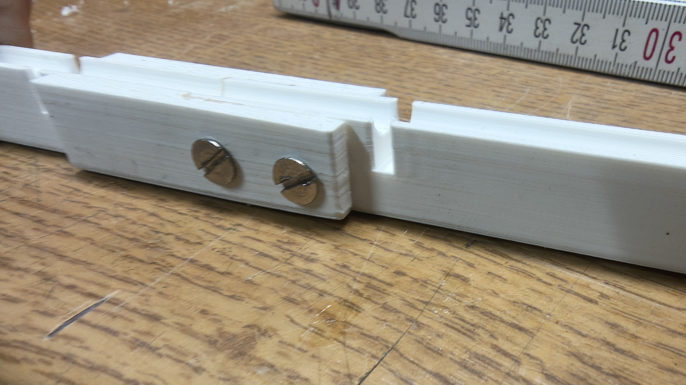
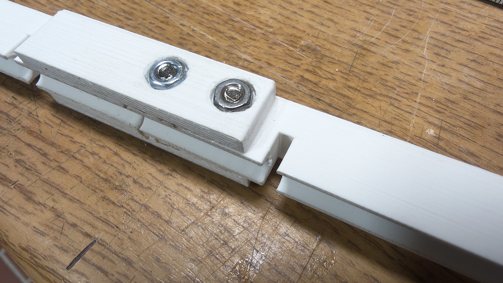
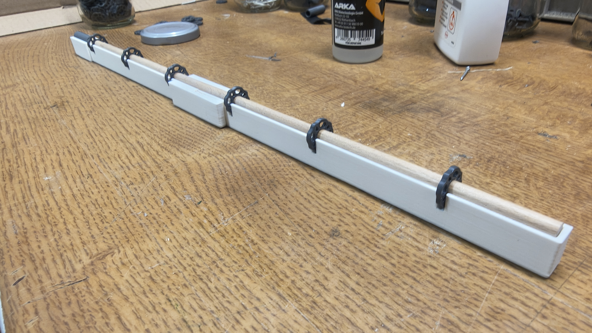

# Zuammbauanleitung Vertikalstangen

## Variationen
Für die Stückliste der einzelnen Variationen siehe [hier](Materialplanung.md#sonstige).
Zur Vereinfachung werden hier nur Rundstab, Flansch und Adapter verwendet.

👉 **[Hier geht es zur separaten Druckteile-Seite](../TeileUbersicht.md)**

## 🛠 Zusammenbau
* Länge den Rundstab auf die benötiget Länge ab
	* 1,0 m -> 129 mm
	* 1,5 m -> 194 mm
	* 2,0 m -> 259 mm
	* 2,5 m -> 324 mm
	* 3,0 m -> 389 mm
* Markiere die Seite die unten sein soll.
* Markiere nun von unten wo die Flansche sein sollen:
	*  26 mm
	*  91 mm
	* 156 mm
	* 221 mm
	* 286 mm
	* 351 mm
* Schiebe die Flansche auf den Rundstab in die Nähe ihrer Markierung
* Klebe die Flansche oberhalb Markierung fest
Achte dabei darauf, dass alle Flansche in die selbe Richtung zeigen.
Der Kleber ist nicht sofort fest,du kannst den Tisch als hilfe nehmen.
* Klebe die Unterseite des Rundstabes in das kleine Loch des Adapters

## Alternativer Zusammenbau mit der Schablone
* Drucke die Schablone für die Vertikalstiele aus (sie passt diagonal auf die meisten Druckplatten): [Schablone zum Ausrichten der Flansche - Anfangsteil](../Drucker%20Dateien/Teildruck%207.7/Schablone%20EGS%20Vertikalstiel%20-%20Anfangsteil.stl) und [Schablone zum Ausrichten der Flansche - Endteil](../Drucker%20Dateien/Teildruck%207.7/Schablone%20EGS%20Vertikalstiel%20-%20Endteil.stl) und klebe beide Teile bündig zusammen:
  

* wer mag, kann die Überblattung der beiden Schablonenteile auch noch mit zwei zusätzlichen Schrauben sichern (Löcher vorher selbst bohren):

   

* Klebe den vertikalen Verbinder (die 30mm lange schmale Hülse)  fest und kontrolliere danach die Gesamtlänge der Vertikalstiele
	* Gesamtlänge Vertikalstiele incl. Vertikalverbinder
 		* 1,0 m -> 144 mm
		* 1,5 m -> 209 mm
		* 2,0 m -> 274 mm
		* 2,5 m -> 339 mm
		* 3,0 m -> 404 mm
* klebe die Flansche an die ungefähren Stellen auf dem Vertikalstiel, die Schablone hilft dann beim korrekten Ausrichten auf 0.5mm genau. Achte auch hier darauf, dass alle Flansche in die selbe Richtung gedreht sind.
  

## 📄 Relevante Dateien
* [Flansch](../Drucker%20Dateien/Teildruck%207.7/Flansch.STL)
* [Vertikalen Verbinder](../Drucker%20Dateien/Teildruck%207.7/Vertikalen%20Verbinder.STL)
* [Schablone zum Ausrichten der Flansche - Anfangsteil](../Drucker%20Dateien/Teildruck%207.7/Schablone%20EGS%20Vertikalstiel%20-%20Anfangsteil.stl)
* [Schablone zum Ausrichten der Flansche - Endteil](../Drucker%20Dateien/Teildruck%207.7/Schablone%20EGS%20Vertikalstiel%20-%20Endteil.stl)
---
[Zurück zur Hauptanleitung](../README.md)
