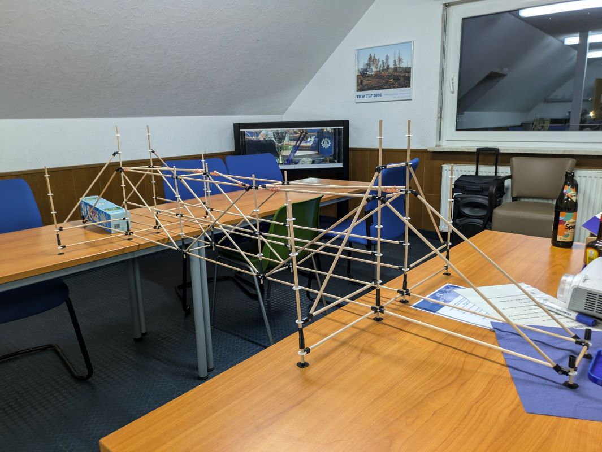

# EGS Modell
Dateispeicher und Entwicklungsdaten für das Einsatz-Gerüst-System als Modellbausatz.
Das Modell hat einen Maßstab 1:7,7.

Beispiel:

## 🛠️ Vorbereitung

Bevor du mit dem Druck startest, beachte bitte diesen Ablauf, um unnötige Druckstunden und Fehlkäufe bei den Zukaufteilen zu vermeiden.
### 1. Toleranz-Check (Schnappverbindungen)
Das Projekt setzt auf Schnappverbindungen. Da 3D-Drucker das Modell oft mit minimalen Abweichungen umsetzen, ist die Passgenauigkeit entscheidend:
* Testdruck: Drucke zuerst nur die Verbindungsstellen:
	* Flansch
	* Diagonale Keilschloss
	* Horizontale Keilschloss
* Anpassung: Sollten die Teile nicht sauber einrasten, [nimm die Korrekturen gezielt in der FreeCAD-Datei vor](#Software-&-Mitwirken).

### 2. Umfang & Beschaffung
Da es sich um einen modularen Bausatz handelt, variiert der Bedarf je nach gewählter Gerüst-Größe.
 [Siehe dazu die Materialplanung.](Anleitungen/Materialplanung.md) 
 Es empfielt sich erst mit der Bodengruppe zu beginnen, da diese in fast jedem anderen Bausatz wiederfindet.

## 🏗️ Montageanleitungen
* [Materialplanung](Anleitungen/Materialplanung.md)
* [Zusammenbau Boden](Anleitungen/ZusammenbauBoden.md)
* [Zusammenbau Diagonale](Anleitungen/ZusammenbauDiagonale.md)
* [Zusammenbau Drehkupplung](Anleitungen/ZusammenbauDrehkupplung.md)
* [Zusammenbau Fuß](Anleitungen/ZusammenbauFuss.md)
* [Zusammenbau Riegel](Anleitungen/ZusammenbauRiegel.md)
* [Zusammenbau Vertikale](Anleitungen/ZusammenbauVertikale.md)

## ❓ Fragen & Problemlösungen
Sollten in den Montageanleitungen noch Fragen offen bleiben kann die FAQ Seite weiter helfen.

👉 **[Hier geht es zur separaten FAQ-Seite](FAQ.md)**

## 🛠 Software & Mitwirken

Das Projekt wird zukünftig primär mit **FreeCAD** entwickelt. Wenn du Änderungen vornehmen möchtest, nutze bitte die Dateien im Ordner `CAD Dateien/FreeCAD/`.

* **Download:** [FreeCAD herunterladen (Open Source)](https://www.freecad.org/)

### Workflow für Mitwirkende:
1. Quelldatei in **FreeCAD** bearbeiten.
2. Nach Änderungen die betroffenen Bauteile als **.stl** exportieren.
3. Die neuen **.stl** Dateien im Ordner **`Drucker Dateien/`** speichern.

## ⚙️ Export-Einstellungen
Damit die Druckdateien konsistent bleiben:
* **Format:** STL
* **Einheit:** mm
* **Speicherort:** `/Drucker Dateien/`

## 📄 Lizenz

Dieses Projekt ist unter der **GNU General Public License v3.0 (GPLv3)** lizenziert.

**Was das bedeutet:**
* ✅ **Freie Nutzung:** Du darfst die CAD-Dateien privat und kommerziell nutzen.
* ✅ **Änderungen:** Du darfst die Modelle verändern und verbessern.
* ⚠️ **Weitergabe:** Wenn du das Projekt oder eine veränderte Version davon verbreitest, **muss** dies ebenfalls unter der GPLv3 geschehen und der Quellcode (die originalen CAD-Dateien, nicht nur STLs!) muss offen zugänglich sein.

Details findest du in der [LICENSE](LICENSE) Datei.