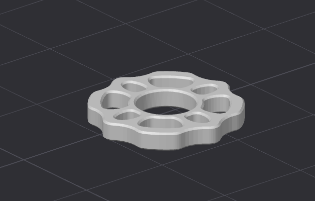
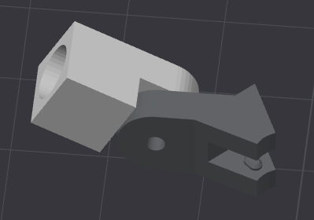
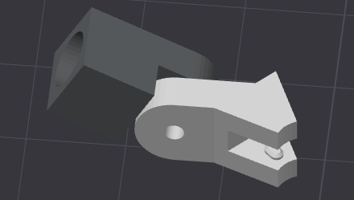
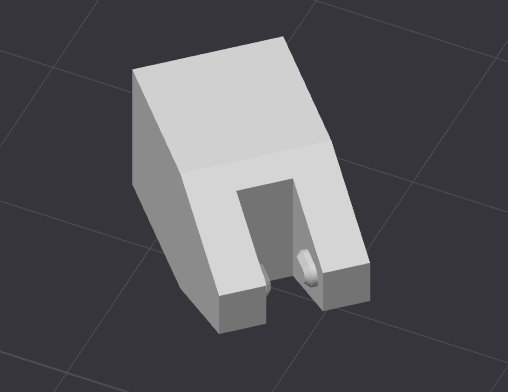
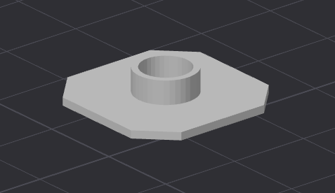
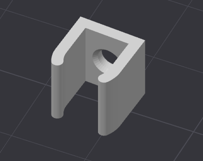
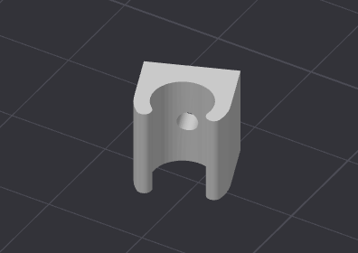

# Übersicht über die Druck-Teile

|  | Dateiname | Bezeichnung der Anleitung | Anleitungen |
| - | - | - | - |
|  | [Flansch 1zu7.7](Drucker-Dateien/Flansch-1zu7.7.STL) | Flansch | [Vertikalstangen](Anleitungen/ZusammenbauVertikale.md) [Füße und Anfangstücke](Anleitungen/ZusammenbauFuss.md) |
|  | [Diagonale Gelenk](Drucker-Dateien/Diagonale-Gelenk.STL) | Gelenk | [Diagonalstangen](Anleitungen/ZusammenbauDiagonale.md) |
|  | [Diagonale Keilschloss](Drucker-Dateien/Diagonale-Keilschloss.STL) | Keilschloss | [Diagonalstangen](Anleitungen/ZusammenbauDiagonale.md) |
|  | [Horizontale Keilschloss](Drucker-Dateien/Horizontale-Keilschloss.STL) | Keilschloss | [Riegel](Anleitungen/ZusammenbauRiegel.md) |
|  | [Vertikalen Verbinder](Drucker-Dateien/Vertikalen-Verbinder.STL) | Adapter | [Vertikalstangen](Anleitungen/ZusammenbauVertikale.md) |
|  | [Fuß](Drucker-Dateien/Fuß.STL) | Fuß | [Füße und Anfangstücke](Anleitungen/ZusammenbauFuss.md) |
|  | [Fußadapter Simpel](Drucker-Dateien/Fußadapter-Simpel.STL) | Adapter | [Füße und Anfangstücke](Anleitungen/ZusammenbauFuss.md) |
|  | [Drehkupplung Klemme](Drucker-Dateien/Drehkupplung-Klemme.STL) | Klemme | [Drehkupplung](Anleitungen/ZusammenbauDrehkupplung.md) |
|  | [Drehkupplung Lose](Drucker-Dateien/Drehkupplung-Lose.STL) | Lose | [Drehkupplung](Anleitungen/ZusammenbauDrehkupplung.md) |

## Sonstige Dateien

|  | Dateiname | Kommentar |
| - | - | - |
| [] | [Boden 3m breit](Drucker-Dateien/Boden-3m-breit.STL) | Der breite 3m Boden in einem Stück. Passt nicht in die meisten Drucker hinein |
| [] | [Boden 3m schmal](Drucker-Dateien/Boden-3m-schmal.STL) | Der schmale 3m Boden in einem Stück. Passt nicht in die meisten Drucker hinein |
| [] | [Flansch](Drucker-Dateien/Flansch.STL) | Der Flansch in orginal Größe |

---
[Zurück zur Hauptanleitung](README.md)